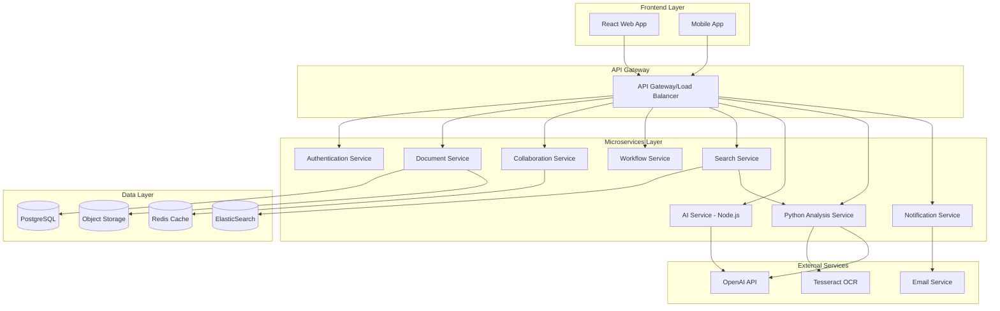

# Design Document - Sistema de Gestão Documental Avançado

## Overview

O Sistema de Gestão Documental Avançado (Advanced DMS) é uma plataforma web moderna que combina gestão tradicional de documentos com capacidades avançadas de IA, colaboração em tempo real e automação de workflows. O sistema é projetado com arquitetura de microserviços para escalabilidade, usando tecnologias modernas como Node.js/NestJS no backend, React no frontend, e integração com serviços de cloud para armazenamento e IA.

## Architecture

### High-Level Architecture



### Service Architecture Pattern

O sistema segue o padrão de microserviços com as seguintes características:
- **API-First Design**: Todas as funcionalidades expostas via REST APIs
- **Event-Driven Architecture**: Comunicação assíncrona entre serviços via message queues
- **CQRS Pattern**: Separação entre operações de leitura e escrita para performance
- **Database per Service**: Cada microserviço tem sua própria base de dados

## Components and Interfaces

### 1. Authentication Service

**Responsabilidades:**
- Gestão de utilizadores e autenticação
- Controle de acesso baseado em papéis (RBAC)
- Integração com OAuth2, LDAP, SAML
- Gestão de sessões e tokens JWT

**APIs Principais:**
```typescript
interface AuthService {
  login(credentials: LoginRequest): Promise<AuthResponse>
  logout(token: string): Promise<void>
  validateToken(token: string): Promise<UserContext>
  getUserPermissions(userId: string, resourceId: string): Promise<Permission[]>
  createUser(userData: CreateUserRequest): Promise<User>
  updateUserRoles(userId: string, roles: Role[]): Promise<void>
}
```

### 2. Document Service

**Responsabilidades:**
- Upload e armazenamento de documentos
- Gestão de metadados e versionamento
- Operações CRUD em documentos e pastas
- Integração com object storage (S3/R2/Wasabi)

**APIs Principais:**
```typescript
interface DocumentService {
  uploadDocument(file: File, metadata: DocumentMetadata): Promise<Document>
  getDocument(documentId: string): Promise<Document>
  updateDocument(documentId: string, updates: DocumentUpdate): Promise<Document>
  deleteDocument(documentId: string): Promise<void>
  createFolder(folderData: CreateFolderRequest): Promise<Folder>
  moveDocument(documentId: string, targetFolderId: string): Promise<void>
  getDocumentVersions(documentId: string): Promise<DocumentVersion[]>
  restoreVersion(documentId: string, versionId: string): Promise<Document>
}
```

### 3. Collaboration Service

**Responsabilidades:**
- Gestão de comentários e anotações
- Notificações em tempo real
- Partilha de documentos e links seguros
- Presença de utilizadores em tempo real

**APIs Principais:**
```typescript
interface CollaborationService {
  addComment(documentId: string, comment: CommentRequest): Promise<Comment>
  getComments(documentId: string): Promise<Comment[]>
  shareDocument(documentId: string, shareOptions: ShareOptions): Promise<ShareLink>
  revokeShare(shareId: string): Promise<void>
  getUserPresence(documentId: string): Promise<UserPresence[]>
  sendNotification(notification: NotificationRequest): Promise<void>
}
```

### 4. Workflow Service

**Responsabilidades:**
- Criação e gestão de workflows customizados
- Execução de etapas de aprovação
- Gestão de tarefas e lembretes
- Automação de processos

**APIs Principais:**
```typescript
interface WorkflowService {
  createWorkflow(workflowData: CreateWorkflowRequest): Promise<Workflow>
  startWorkflow(documentId: string, workflowId: string): Promise<WorkflowInstance>
  completeTask(taskId: string, result: TaskResult): Promise<void>
  getWorkflowStatus(instanceId: string): Promise<WorkflowStatus>
  createReminder(reminderData: ReminderRequest): Promise<Reminder>
  getUpcomingTasks(userId: string): Promise<Task[]>
}
```

### 5. Search Service

**Responsabilidades:**
- Indexação de documentos e metadados
- Pesquisa full-text e filtros avançados
- Integração com OCR para documentos escaneados
- Sugestões de pesquisa inteligentes

**APIs Principais:**
```typescript
interface SearchService {
  indexDocument(document: Document): Promise<void>
  search(query: SearchQuery): Promise<SearchResults>
  suggest(partialQuery: string): Promise<SearchSuggestion[]>
  getFilters(): Promise<SearchFilter[]>
  performOCR(documentId: string): Promise<OCRResult>
}
```

### 6. AI Service (Node.js)

**Responsabilidades:**
- Geração de documentos com IA
- Coordenação com Python Analysis Service
- Templates e workflows de IA
- Interface com OpenAI API

**APIs Principais:**
```typescript
interface AIService {
  generateDocument(prompt: string, template?: string): Promise<GeneratedDocument>
  createTemplate(templateData: TemplateRequest): Promise<Template>
  processWithAI(content: string, operation: string): Promise<AIResult>
}
```

### 7. Python Analysis Service

**Responsabilidades:**
- OCR processing com Tesseract
- Análise avançada de documentos
- Extração de entidades com NLP
- Processamento de imagens e PDFs

**APIs Principais:**
```python
class DocumentAnalysisService:
    def perform_ocr(self, document_path: str) -> OCRResult
    def analyze_document(self, document_id: str) -> DocumentAnalysis
    def extract_entities(self, text: str) -> List[ExtractedEntity]
    def summarize_content(self, text: str) -> DocumentSummary
    def detect_document_type(self, content: bytes) -> DocumentType
    def extract_metadata(self, document_path: str) -> DocumentMetadata
```

## Data Models

### Core Entities

```typescript
interface User {
  id: string
  email: string
  name: string
  roles: Role[]
  createdAt: Date
  lastLoginAt: Date
  isActive: boolean
}

interface Document {
  id: string
  name: string
  type: string
  size: number
  folderId: string
  ownerId: string
  storageKey: string
  metadata: DocumentMetadata
  versions: DocumentVersion[]
  permissions: Permission[]
  createdAt: Date
  updatedAt: Date
}

interface DocumentMetadata {
  title?: string
  description?: string
  tags: string[]
  customFields: Record<string, any>
  extractedText?: string
  ocrProcessed: boolean
}

interface Folder {
  id: string
  name: string
  parentId?: string
  ownerId: string
  permissions: Permission[]
  createdAt: Date
  updatedAt: Date
}

interface Comment {
  id: string
  documentId: string
  userId: string
  content: string
  pageNumber?: number
  position?: CommentPosition
  parentId?: string
  createdAt: Date
  updatedAt: Date
}

interface Workflow {
  id: string
  name: string
  description: string
  steps: WorkflowStep[]
  isActive: boolean
  createdBy: string
  createdAt: Date
}

interface WorkflowStep {
  id: string
  name: string
  type: 'approval' | 'review' | 'notification' | 'automation'
  assignees: string[]
  conditions: StepCondition[]
  actions: StepAction[]
  timeoutHours?: number
}
```

### Database Schema Design

**PostgreSQL Tables:**
- `users` - Informação de utilizadores e autenticação
- `documents` - Metadados de documentos
- `folders` - Estrutura hierárquica de pastas
- `document_versions` - Histórico de versões
- `permissions` - Controle de acesso granular
- `comments` - Comentários e anotações
- `workflows` - Definições de workflows
- `workflow_instances` - Execuções de workflows
- `tasks` - Tarefas e lembretes
- `audit_logs` - Registo de auditoria
- `share_links` - Links de partilha seguros
- `ocr_results` - Resultados de processamento OCR
- `analysis_cache` - Cache de análises de documentos

### Python Service Technology Stack

**Core Framework:**
- **FastAPI** - High-performance web framework for APIs
- **Pydantic** - Data validation and serialization
- **Uvicorn** - ASGI server for production deployment

**OCR and Document Processing:**
- **Tesseract OCR** - Open source OCR engine
- **pytesseract** - Python wrapper for Tesseract
- **Pillow (PIL)** - Image processing and manipulation
- **OpenCV** - Computer vision and image preprocessing
- **PyPDF2/pdfplumber** - PDF text extraction
- **python-magic** - File type detection

**NLP and Analysis:**
- **spaCy** - Industrial-strength NLP library
- **transformers** - Hugging Face transformers for summarization
- **NLTK** - Natural language processing toolkit
- **scikit-learn** - Machine learning for classification
- **textblob** - Simple text processing

**Data and Caching:**
- **Redis** - Caching and message queuing
- **SQLAlchemy** - Database ORM (if needed)
- **asyncpg** - Async PostgreSQL driver

**ElasticSearch Indices:**
- `documents_index` - Conteúdo indexado para pesquisa
- `audit_index` - Logs de auditoria para análise
- `analytics_index` - Métricas de utilização

## Error Handling

### Error Categories

1. **Validation Errors (400)**
   - Dados de entrada inválidos
   - Formatos de ficheiro não suportados
   - Tamanho de ficheiro excedido

2. **Authentication Errors (401/403)**
   - Token inválido ou expirado
   - Permissões insuficientes
   - Utilizador não autorizado

3. **Resource Errors (404/409)**
   - Documento não encontrado
   - Conflito de versões
   - Pasta já existe

4. **System Errors (500)**
   - Falhas de armazenamento
   - Erros de conectividade
   - Falhas de processamento de IA

### Error Response Format

```typescript
interface ErrorResponse {
  error: {
    code: string
    message: string
    details?: any
    timestamp: string
    requestId: string
  }
}
```

### Retry and Resilience Patterns

- **Circuit Breaker**: Para serviços externos (OpenAI, OCR)
- **Exponential Backoff**: Para operações de retry
- **Bulkhead Pattern**: Isolamento de recursos críticos
- **Timeout Configuration**: Timeouts apropriados por operação

## Testing Strategy

### Unit Testing
- **Coverage Target**: 90% para lógica de negócio
- **Framework**: Jest para Node.js, React Testing Library para frontend
- **Mocking**: Serviços externos e bases de dados
- **Test Data**: Factories para geração de dados de teste

### Integration Testing
- **API Testing**: Testes end-to-end das APIs REST
- **Database Testing**: Testes com base de dados de teste
- **Message Queue Testing**: Testes de comunicação assíncrona
- **File Upload Testing**: Testes de upload com diferentes tipos de ficheiro

### Performance Testing
- **Load Testing**: Simulação de carga com múltiplos utilizadores
- **Stress Testing**: Testes de limites do sistema
- **Volume Testing**: Testes com grandes volumes de documentos
- **Latency Testing**: Medição de tempos de resposta

### Security Testing
- **Authentication Testing**: Testes de login e autorização
- **Permission Testing**: Verificação de controle de acesso
- **Input Validation**: Testes de segurança de entrada
- **File Security**: Testes de upload malicioso

### Test Automation Pipeline


### Monitoring and Observability

**Application Metrics:**
- Request latency e throughput
- Error rates por endpoint
- Document upload/download metrics
- User activity metrics

**Infrastructure Metrics:**
- CPU, memória e disk usage
- Database performance metrics
- Object storage metrics
- Network latency

**Business Metrics:**
- Número de documentos ativos
- Utilizadores ativos diários/mensais
- Workflows completados
- Storage utilization

**Alerting Strategy:**
- Critical alerts para falhas de sistema
- Warning alerts para degradação de performance
- Business alerts para métricas anómalas
- Integration com Slack/Teams para notificações